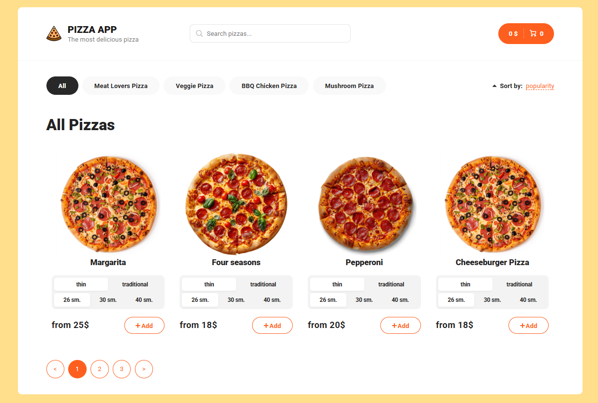

# Pizza Ordering App 🍕

  

A modern pizza ordering application with product catalog, search, and pagination features.

## Features ✨
- **Pizza Catalog** with pagination (React Paginate)
- **Search functionality** with debouncing (Lodash.debounce)
- **Product filtering** by various criteria
- **Shopping cart management** (Redux Toolkit)
- **Responsive design** with SCSS styling
- **API integration** (Axios)
- **Routing** (React Router 6)
- **Skeleton loading states** (React Content Loader)
- **Unit tests** (React Testing Library)

## Technologies Used 🛠️
- **React 18** - Frontend framework
- **Redux Toolkit** - State management
- **React Router 6** - Navigation
- **Axios** - HTTP client
- **Sass/SCSS** - Styling
- **React Paginate** - Pagination component
- **Lodash.debounce** - Search optimization
- **QS** - Query string parsing

## Installation 🚀

### Prerequisites
- Node.js (v18+)
- npm (v9+)

1. **Clone the repository**
bash
git clone https://github.com/your-username/pizza-app.git
cd pizza-app

2. **Install dependencies** 
npm install

3. **Start development server**
npm start

4. **Open in browser**
http://localhost:3000

## Project Structure 📁

pizza-app/
├── public/          # Static assets
├── src/
│   ├── assets/      # Images & fonts
│   ├── components/  # Reusable components
│   ├── features/    # Redux slices
│   ├── hooks/       # Custom hooks
│   ├── pages/       # Application views
│   ├── scss/        # Global styles
│   ├── services/    # API services
│   ├── App.jsx      # Root component
│   └── store.js     # Redux store
├── package.json
└── README.md

## Scripts 📜
Command	Description
npm start	Start development server
npm build	Create production build
npm test	Run unit tests
npm eject	Eject from CRA (advanced)

## API Integration 🔗

The app requires a backend API for full functionality. Example environment variables:

- REACT_APP_API_URL=https://your-pizza-api.com
- REACT_APP_PAGE_LIMIT=4

**Typical endpoints:**

GET /pizzas - Get paginated pizza list

GET /pizzas/:id - Get single pizza details

GET /categories - Get pizza categories

**Styling Guidelines 🎨**
Uses SCSS modules for component styling

Global variables in scss/_variables.scss

**Breakpoints:**

Mobile: < 768px
Tablet: 768px - 1024px
Desktop: > 1024px

## Deployment 🚢
1. **Create production build:**
npm run build

2. **Deploy build/ folder to hosting service:**

- Vercel
- Netlify
- Firebase Hosting
- GitHub Pages

## License 📄
This project is licensed under the MIT License.

**Developer: baisalov24**
**GitHub: https://github.com/Baisalov24**